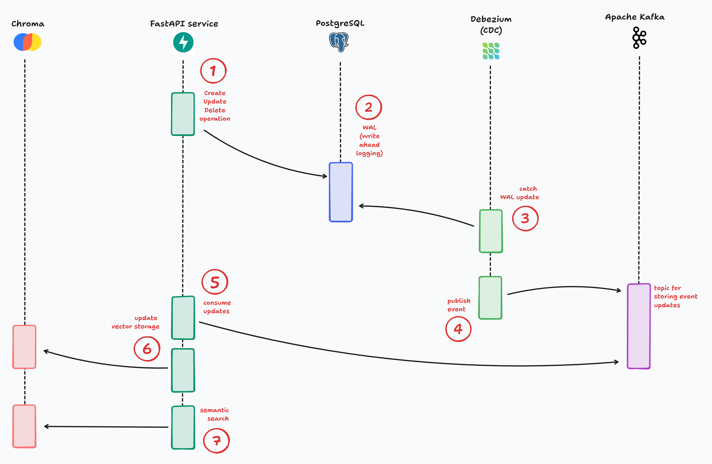
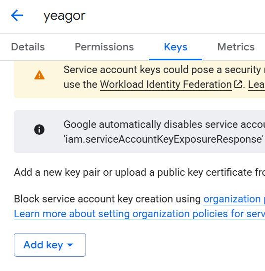

# **Sequence diagram**

# **Environment setup**
### 1. Create a Google Service Account
Follow this link to create a service account:
https://console.cloud.google.com/iam-admin/serviceaccounts

### 2. Create a JSON key
Go to: 
IAM & Admin → Service Accounts → Your Account → Keys \
Then click "Add Key" → "Create new key", and select the JSON format. \

### 3. Add the JSON key to your project

### 4. Create .env file:
Provide following variables: \
`GOOGLE_APPLICATION_CREDENTIALS` - path to your json file \
`GCP_LOCATION` - us-central1 _(default)_ \
`GCP_PROJECT` - "project_id" from json file \
`KAFKA_TOPICS` - should include topic that will be autocreated by Debezium connector, it will be `recipe-updates.public.recipe` topic by default 

Configure your environment variables by creating a **`.env`** file based on **`.env.template`**. 

# **Running the Application**

### 5. Run Docker-compose
Start all services using Docker Compose: \
`docker-compose up`

### 6. Send Debezium JSON config
After Docker Compose is up, send the Debezium connector configuration. \
Example: \
Send a POST request to http://localhost:8087/connectors/ with the body content from \
`bootstrap/debezium/debezium_config.json`.

### 7. Install dependencies
Install the required packages using pip: \
`pip install -r requirements.txt`

### 8. Run alembic migrations
Apply database migrations from the root directory of your project: \
`alembic upgrade head`
